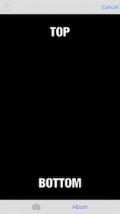

# MemeMe

CURRENTLY UNDERGOING REVISIONS TO MAKE SWIFT 3+ COMPLIANT!

## Overview

- Multi-view Swift app that takes pictures and overlays text to make memes that are shared via social media or email and displayed in a table or collection view
- Built in the Udacity course _UIKit Fundamentals_ and focuses on UIKit functionality that incorporates Tab Bar View Controllers, Activity View Controllers, Table Views, and Collection Views

## Screenshots

    
